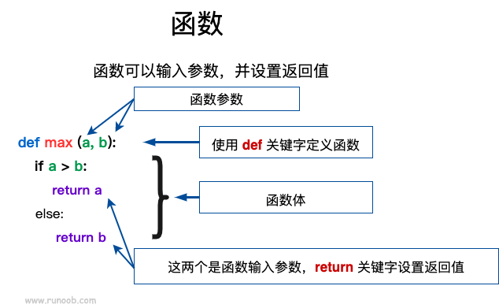

- [语法结构](#%E8%AF%AD%E6%B3%95%E7%BB%93%E6%9E%84)
    - [函数名](#%E5%87%BD%E6%95%B0%E5%90%8D)
    - [函数描述](#%E5%87%BD%E6%95%B0%E6%8F%8F%E8%BF%B0)
    - [函数调用](#%E5%87%BD%E6%95%B0%E8%B0%83%E7%94%A8)
    - [参数传递](#%E5%8F%82%E6%95%B0%E4%BC%A0%E9%80%92)
        - [必需参数](#%E5%BF%85%E9%9C%80%E5%8F%82%E6%95%B0)
        - [关键字参数](#%E5%85%B3%E9%94%AE%E5%AD%97%E5%8F%82%E6%95%B0)
        - [默认参数](#%E9%BB%98%E8%AE%A4%E5%8F%82%E6%95%B0)
        - [不定长参数](#%E4%B8%8D%E5%AE%9A%E9%95%BF%E5%8F%82%E6%95%B0)
        - [强制位置参数](#%E5%BC%BA%E5%88%B6%E4%BD%8D%E7%BD%AE%E5%8F%82%E6%95%B0)
- [代码示例](#%E4%BB%A3%E7%A0%81%E7%A4%BA%E4%BE%8B)

---

# [def函数](https://www.runoob.com/python3/python3-function.html)

> 函数是组织好的，可重复使用的，用来实现单一，或相关联功能的代码段。



## 语法结构

```text
def 函数名（参数列表）:
    函数体
```

简单Hello World示例：

```python
"""Hello World"""


def hello():
    """Hello World"""
    print("Hello World!")


hello()
```

综上，不难看出 `python` 中的函数定义的几个特点：

### 函数名

函数名由 `小写字母` 、`_`组成（严格遵循`python`中的蛇形命名法），必要时也可以是用 `数字`

### 函数描述

定义函数时，应在函数名下使用 `""" """` 三引号对该函数进行描述，注明函数中需要的参数以及返回值，
例如 [爬虫示例](../cralwers/demo.py) 中的函数规范。

### 函数调用

一个函数的基本结构完成以后，你可以通过另一个函数调用执行，也可以直接从 Python 命令行执行。
如以上实例调用了 `hello()` 函数

### 参数传递

以下是调用函数时可使用的正式参数类型：

#### 必需参数

必需参数须以正确的顺序传入函数。调用时的数量必须和声明时的一样。

调用 print_string() 函数，你必须传入一个参数，不然会出现语法错误

```python
"""打印出传入的字符串"""


def print_string(text: str) -> str:
    """
    print_string
    :param text: 
    :return: 
    """
    return text


print(print_string('test'))
```

#### 关键字参数

使用关键字参数允许函数调用时参数的顺序与声明时不一致，因为 Python 解释器能够用参数名匹配参数值。

以下实例在函数 keywords_function() 调用时使用参数名

```python
"""keywords_function"""


def keywords_function(k: str):
    """打印任何传入的字符串"""
    return k


# 调用keywords_function函数
print(keywords_function('test'))
```

#### 默认参数

调用函数时，如果没有传递参数，则会使用默认参数。以下实例中如果没有传入 age 参数，则使用默认值

```python
"""默认参数的情况"""


def demo(index: str = 'test'):
    """demo"""
    return index


# 函数调用
demo()  # 可不传递参数
# 也可以按照一下方法指定参数内容
demo(index='foo')
# return 'foo'
```

#### 不定长参数

有时需要一个函数能够处理比当初声明时更多的参数。这些参数叫做不定长参数，和上述 2 种参数不同，声明时不会命名。

基本语法如下:

- 不定,可变参数

> 可变参数，在定义函数是用 `*args` 来接受，其中 `*` 是规定的，`args` 可用其他名称替换，但一般习惯用 `args` 来表示

```python
"""使用args做不定参数"""


def demo(a, *args):
    """demo"""
    print(f'a={a}')
    print(f'args={args}')


demo(1, 3, 4, 5, 6)
# 返回值:
# a=1
# args=(3, 4, 5, 6)
```

- 不定关键字参数 `kwargs`

> 关键字参数使用 `kwargs` 来标识，是规定，而 `kwargs` 可替换，它将不定长参数转换为 `dict` 传入函数。它用于扩展函数的功能

```python
"""**kwargs使用"""


def demo(a, **kwargs):
    """demo"""
    print(f'a={a}')
    print(f'args={kwargs}')


demo(1, b=1, c=2)
# 返回值:
# a=1
# args={'b': 1, 'c': 2}
```

#### 强制位置参数

## 代码示例

```python
"""def函数示例练习"""


# 实现一个计算列表中元素个数的函数
def count_list(source_list: list):
    """
    count
    :param source_list:
    :return:
    """
    result = len(source_list)
    return result


# 实现 get_max 函数,函数最终返回列表lst的最大值,不要使用内置max函数
def get_max(lst: list):
    """
    get list max value
    :param lst:
    :return:
    """
    if not list:
        return None
    max_value = lst[0]
    for item in lst:
        if item > max_value:
            max_value = item
    return max_value


# 实现函数get_max_score， 执行程序，最终输出最高成绩
def get_max_score(score_dic: dict):
    """
    get_max_score
    :param score_dic:
    :return:
    """
    max_score = 0
    max_score_course = ''
    for course, score in score_dic.items():
        if score > max_score:
            max_score = score
            max_score_course = course

    return max_score_course, max_score
```
