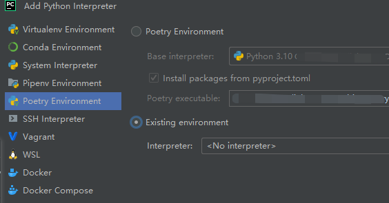

# 技术准备

## 开发环境搭建

本项目使用 python3.10/3.11。具体版本的 python 环境可以在 [官网](https://www.python.org/downloads/) 自行下载安装。

## IDE 使用

推荐使用 [Pycharm](https://www.jetbrains.com/pycharm/) 开发工具，初学者页可以选择免费的社区版本 (Professional)。

## 虚拟环境使用

> 在 Python 开发中使用虚拟环境（Virtual Environment）可以帮助开发者更好地管理项目依赖和避免冲突。
>
> 当我们在本地安装了多个 Python 库和依赖时，这些库可能会相互冲突，导致程序无法正常工作。
>
> 使用虚拟环境可以解决这个问题，因为每个虚拟环境都有自己独立的 Python 解释器和依赖，不会干扰其他虚拟环境或本地 Python 环境。

本项目中推荐使用 `poetry`，该工具既包含虚拟环境管理也支持打包发布等功能。

在安装好 Python 环境后，在全局环境中安装 poetry

```bash
# 安装最新版本的pip工具
python -m pip install -U pip
# 安装 poetry
pip install -U poetry
```

poetry 的详细命令可以到其 [官方](https://python-poetry.org/) 查看

- 本地部署时使用命令进入项目依赖环境

```bash
# 在项目目录下安装项目所需依赖
poetry install
# 安装完成后进进入依赖虚拟环境
poetry shell
```

若由于网络等因素导致 `poetry install` 过程失败，可以先进入 `poetry shell` 手动使用 `pip install [name]` 安装

随后在 ide 中设置本地语言环境配置

这里以 pycharm 为例，安装好 poetry 环境后

> Check menu bar, click `File` --> `Settings` --> `Project Settings` --> `Python Interpreter` --> `Add` 添加 `poetry existing environment`（现有环境）


