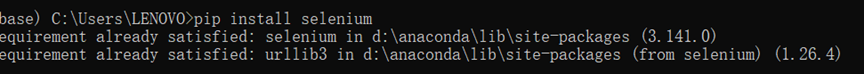

- [selenium是什么?](#selenium%E6%98%AF%E4%BB%80%E4%B9%88)
- [适用场景](#%E9%80%82%E7%94%A8%E5%9C%BA%E6%99%AF)
- [Selenium 的缺点：](#selenium-%E7%9A%84%E7%BC%BA%E7%82%B9)
- [selenium 安装与使用](#selenium-%E5%AE%89%E8%A3%85%E4%B8%8E%E4%BD%BF%E7%94%A8)
- [使用selenium爬虫练习](#%E4%BD%BF%E7%94%A8selenium%E7%88%AC%E8%99%AB%E7%BB%83%E4%B9%A0)
- [爬虫过程指导](#%E7%88%AC%E8%99%AB%E8%BF%87%E7%A8%8B%E6%8C%87%E5%AF%BC)
    - [使用浏览器解析网页结构](#%E4%BD%BF%E7%94%A8%E6%B5%8F%E8%A7%88%E5%99%A8%E8%A7%A3%E6%9E%90%E7%BD%91%E9%A1%B5%E7%BB%93%E6%9E%84)

---

# [selenium](https://www.selenium.dev/zh-cn/documentation/)

## selenium是什么?

web自动化工具

---

> Selenium是一个基于浏览器的自动化工具，它提供了一种跨平台、跨浏览器的端到端的web自动化解决方案。
> Selenium主要包括三部分：
>
> - Selenium IDE： Firefox浏览器的一个插件（扩展），它可以进行录制回放，
    > 并且可以把录制的操作以多种语言（如JAVA、Python、C#等）的形式导出成测试用例。
> - Selenium WebDriver： 提供Web自动化所需的API，主要用作浏览器控制、页面元素选择和调试。
    > 不同的浏览器需要不同的WebDriver。
> - Selenium Grid： 提供了在不同机器的不同浏览器上运行selenium测试的能力。

这里的框架主要使用Python结合Selenium WebDriver库进行搭建的。通常，
一个典型的自动化测试框架一般包括用例管理模板、自动化执行控制器、报表生成模块、日志模块和邮件发送模块等。

## 适用场景

在爬虫场景中，可大致分为两中，一种是直接想其发起`HTTP`就可以请求出数据，我们称其为静态网站，
这种网站可以选用`requests`、`httpx`等请求库结合页面解析库来实现静态抓取；
另外是不能通过单纯访问获得的，比如在请求网站是，需要js加载、浏览器模式识别等，这时，
通过`selenium`才可以爬取执行 `js` 后的网页数据，实现“所见即所得”。正因如此，要等网页加载完`selenium`才能爬取成功,否则也无法爬出数据

## Selenium 的缺点:

- 速度慢，每次运行爬虫都打开一个浏览器，如果没有设置，还会加载图片、JS等等一大堆东西。
- 占用资源太多。
- 对网络的要求会更高。 Selenium 加载了很多可能对您没有价值的补充文件（如css，js和图像文件）。
  与仅仅请求您真正需要的资源（使用单独的HTTP请求）相比，这可能会产生更多的流量。

## [selenium](https://www.selenium.dev/) 安装与使用

- 1、安装selenium包

`cmd` 命令行下 用 `pip install selenium` 安装
（若是anaconda环境则可以直接进入anaconda)


- 2、安装selenium对应的浏览器驱动

官网中找到与浏览器版本对应的selenium驱动(WebDriver)。
以谷歌chrome浏览器为例，查看浏览器版本，同时在官网中找到对应的驱动包，下载并解压。

selenium除此之外还提供了很多浏览器模式，详细如下

| browser | download link                                                                                                                                  |
|---------|------------------------------------------------------------------------------------------------------------------------------------------------|
| Chrome  | [https://chromedriver.chromium.org/downloads](https://chromedriver.chromium.org/downloads)                                                     |
| Edge    | [https://developer.microsoft.com/en-us/microsoft-edge/tools/webdriver/](https://developer.microsoft.com/en-us/microsoft-edge/tools/webdriver/) |
| Firefox | [https://github.com/mozilla/geckodriver/releases](https://github.com/mozilla/geckodriver/releases)                                             |
| Safari  | [https://webkit.org/blog/6900/webdriver-support-in-safari-10/](https://webkit.org/blog/6900/webdriver-support-in-safari-10/)                   |

将解压好的chromedriver.exe文件分别放置在chrome浏览器目录下以及anaconda（或python）Scripts目录下。

为使用方便，可将上述两个目录添加环境变量中。

## 使用selenium爬虫练习

爬虫示例代码：

```python
"""crawler corporate info"""
import time

from selenium import webdriver
from selenium.webdriver.chrome.options import Options
from selenium.webdriver.common.by import By

company_info = {}
chrome_options = Options()
chrome_options.add_argument('--headless')
url = 'https://www.11467.com/shenzhen/dir/i67.htm'
browser = webdriver.Chrome(chrome_options=chrome_options)
time.sleep(2)
browser.get(url)  # 网络请求
time.sleep(3)
# 页面解析
company_info_list = browser.find_elements(By.CLASS_NAME, 'f_l')  # get 所有 class name 为f_l的元素
num = 1
for i in company_info_list:
    company_info['title'] = i.find_element(By.TAG_NAME, 'h4').text
    company_info['product'] = i.find_elements(By.TAG_NAME, 'div')[0].text
    company_info['address'] = i.find_elements(By.TAG_NAME, 'div')[1].text
    try:
        company_info['funds'] = i.find_elements(By.TAG_NAME, 'span')[0].text
        company_info['create_date'] = i.find_elements(By.TAG_NAME, 'span')[1].text  # By.TAG_NAME 通过标签名来获取
    except IndexError:
        company_info['funds'] = ''
        company_info['create_date'] = ''
    try:
        company_info['link'] = i.find_element(By.CLASS_NAME, 'shop').get_attribute('href')  # get_attribute获取标签属性值
    except Exception as exc:
        print(exc)
        company_info['link'] = ''
    num += 1
    print(company_info)

browser.quit()
```

使用def函数方式封装：

```python
"""
自定义def函数
"""


def init_browser(_url: str):
    """
    init browser

    注意：在定义def函数时，在函数内使用三个双引号对该方法进行简单必要描述，
    同时， :param 参数:代表该函数中需要传入的参数，其中参数后使用：冒号来描述该函数的数据类型
          :return obj:代表该函数中返回的值类型        
    :param _url: 
    :return: 
    """
    pass 
```

- [pass](https://www.runoob.com/python/python-pass-statement.html) 为空代码，
  不作为程序的实现逻辑，是为了保持程序结构的完整性，也可将其理解为占位作用。

使用def函数进一步封装爬虫代码代码如下：

```python
"""爬虫教学"""
import csv
import datetime
import time
from pathlib import Path
from typing import List

from selenium import webdriver
from selenium.webdriver.chrome.options import Options
from selenium.webdriver.common.by import By


# 导入所需依赖

def init_browser(
        target_url: str = 'https://www.11467.com/shenzhen/dir/i67.htm',
        headless: bool = True
):
    """
    init browser
    
    初始化浏览器对象，通过参数控制浏览器的有头无头模式
    
    :param headless:
    :param target_url:
    :return:
    """
    if headless:
        _chrome_options = Options()
        _chrome_options.add_argument('--headless')
        _browser = webdriver.Chrome(chrome_options=_chrome_options)
    else:
        _browser = webdriver.Chrome()
    time.sleep(3)
    _browser.get(target_url)
    return _browser


def parse_page(_browser) -> List[dict]:
    """
    parse page
    
    通过上述方法中获取的页面，进行页面解析
    :param _browser:
    :return:
    """
    info_list = []
    company_info_list = _browser.find_elements(By.CLASS_NAME, 'f_l')  # get 所有 class name 为f_l的元素
    num = 1
    for i in company_info_list:
        _company_info = {
            'title': i.find_element(By.TAG_NAME, 'h4').text,
            'product': i.find_elements(By.TAG_NAME, 'div')[0].text,
            'address': i.find_elements(By.TAG_NAME, 'div')[1].text,
            'funds': '',
            'create_date': '',
            'link': ''
        }
        extra_infos = i.find_elements(By.TAG_NAME, 'span')
        if extra_infos:
            if len(extra_infos) > 1:
                _company_info.update({'funds': extra_infos[0].text})
                _company_info.update({'create_date': extra_infos[1].text})
            if len(extra_infos) < 2:
                if '成立时间' in extra_infos[0].text:
                    _company_info.update({'create_date': extra_infos[0].text})
                if '注册资本' in extra_infos[0].text:
                    _company_info.update({'funds': extra_infos[0].text})
        try:
            _company_info.update(
                {'link': i.find_element(By.CLASS_NAME, 'shop').get_attribute('href')})  # get_attribute获取标签属性值
        except Exception:
            info_list.append(_company_info)
        num += 1
    print(info_list)
    return info_list


def write_to_file(info: List[dict]):
    """
    write to file
    
    将解析好的数据写入本地csv文件
    :param info:
    :return:
    """
    keys = info[0].keys()
    with open(
            Path(f'company-info-{datetime.datetime.now().date()}.csv'),
            'w', newline='', encoding='utf-8'
    ) as file:
        dict_writer = csv.DictWriter(file, keys)
        dict_writer.writeheader()
        dict_writer.writerows(info)


# 使用main方法来执行以上程序
if __name__ == '__main__':
    browser = init_browser()
    company_info = parse_page(browser)
    write_to_file(company_info)
```
