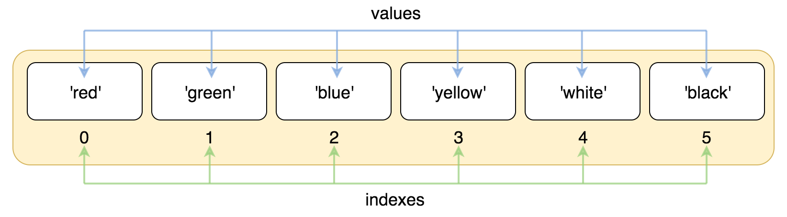
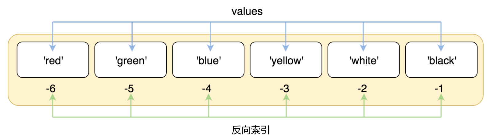
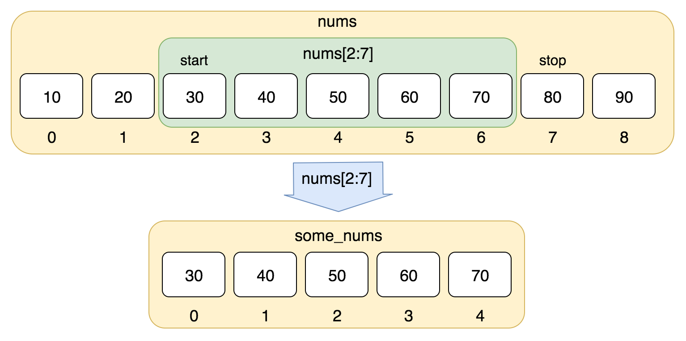

- [变量的使用](#%E5%8F%98%E9%87%8F%E7%9A%84%E4%BD%BF%E7%94%A8)
- [赋值运算符](#%E8%B5%8B%E5%80%BC%E8%BF%90%E7%AE%97%E7%AC%A6)
- [变量命名](#%E5%8F%98%E9%87%8F%E5%91%BD%E5%90%8D)
    - [正确命名规范](#%E6%AD%A3%E7%A1%AE%E5%91%BD%E5%90%8D%E8%A7%84%E8%8C%83)
- [变量和类型](#%E5%8F%98%E9%87%8F%E5%92%8C%E7%B1%BB%E5%9E%8B)
- [数值型（Number）](#%E6%95%B0%E5%80%BC%E5%9E%8Bnumber)
    - [整数型（int）](#%E6%95%B4%E6%95%B0%E5%9E%8Bint)
    - [浮点型(float)](#%E6%B5%AE%E7%82%B9%E5%9E%8Bfloat)
- [运算符](#%E8%BF%90%E7%AE%97%E7%AC%A6)
- [比较运算符和逻辑运算符](#%E6%AF%94%E8%BE%83%E8%BF%90%E7%AE%97%E7%AC%A6%E5%92%8C%E9%80%BB%E8%BE%91%E8%BF%90%E7%AE%97%E7%AC%A6)
- [字符串(str)](#%E5%AD%97%E7%AC%A6%E4%B8%B2str)
    - [字符串拼接](#%E5%AD%97%E7%AC%A6%E4%B8%B2%E6%8B%BC%E6%8E%A5)
- [列表(list)](#%E5%88%97%E8%A1%A8list)
- [字典（dict）](#%E5%AD%97%E5%85%B8dict)
- [元组(tuple)](#%E5%85%83%E7%BB%84tuple)
- [集合(set)](#%E9%9B%86%E5%90%88set)
- [练习](#%E7%BB%83%E4%B9%A0)

---

# python基本数据类型

## 变量的使用

下面通过几个例子来说明变量的类型和变量使用。

```Python
"""
使用变量保存数据并进行加减乘除运算
"""
a = 321
b = 12
print(a + b)  # 333
print(a - b)  # 309
print(a * b)  # 3852
print(a / b)  # 26.75
```

在Python中可以使用`type`
函数对变量的类型进行检查。程序设计中函数的概念跟数学上函数的概念是一致的，数学上的函数相信大家并不陌生，它包括了函数名、自变量和因变量。如果暂时不理解这个概念也不要紧，我们会在后续的章节中专门讲解函数的定义和使用。

```Python
"""
使用type()检查变量的类型
"""
a = 100
b = 12.345
c = 1 + 5j
d = 'hello, world'
e = True
print(type(a))  # <class 'int'>
print(type(b))  # <class 'float'>
print(type(c))  # <class 'complex'>
print(type(d))  # <class 'str'>
print(type(e))  # <class 'bool'>
```

可以使用Python中内置的函数对变量类型进行转换。

- `int()`：将一个数值或字符串转换成整数，可以指定进制。
- `float()`：将一个字符串转换成浮点数。
- `str()`：将指定的对象转换成字符串形式，可以指定编码。
- `chr()`：将整数转换成该编码对应的字符串（一个字符）。
- `ord()`：将字符串（一个字符）转换成对应的编码（整数）。

下面的代码通过键盘输入两个整数来实现对两个整数的算术运算。

```Python
"""
使用input()函数获取键盘输入(字符串)
使用int()函数将输入的字符串转换成整数
使用print()函数输出带占位符的字符串
"""
a = int(input('a = '))
b = int(input('b = '))
print('%d + %d = %d' % (a, b, a + b))
print('%d - %d = %d' % (a, b, a - b))
print('%d * %d = %d' % (a, b, a * b))
print('%d / %d = %f' % (a, b, a / b))
print('%d // %d = %d' % (a, b, a // b))
print('%d %% %d = %d' % (a, b, a % b))
print('%d ** %d = %d' % (a, b, a ** b))
```

> **说明**：上面的print函数中输出的字符串使用了占位符语法，其中`%d`是整数的占位符，`%f`是小数的占位符，`%%`表示百分号（因为百分号代表了占位符，所以带占位符的字符串中要表示百分号必须写成`%%`），字符串之后的`%`
> 后面跟的变量值会替换掉占位符然后输出到终端中，运行上面的程序，看看程序执行结果就明白啦。

## 赋值运算符

赋值运算符应该是最为常见的运算符，它的作用是将右边的值赋给左边的变量。下面的例子演示了赋值运算符和复合赋值运算符的使用。

```Python
"""
赋值运算符和复合赋值运算符
"""
a = 10
b = 3
a += b  # 相当于：a = a + b
a *= a + 2  # 相当于：a = a * (a + 2)
print(a)  # 算一下这里会输出什么
```

## 变量命名

> 变量是存储在内存中的值，
> 每个变量在使用前都必须赋值，变量赋值以后该变量才会被创建，等号 `=` 用来给变量赋值。等号 `=` 运算符左边是一个变量名，等号 `=` 运算符右边是存储在变量中的值
> Python 中的变量赋值不需要类型声明（为了代码严谨通常开发时候也要求在变量后使用 `:` 注明变量类型。例如 `a:str = 'a'; b:int = 1`）

对于每个变量我们需要给它取一个名字，就如同我们每个人都有属于自己的响亮的名字一样。在Python中，变量命名需要遵循以下这些必须遵守硬性规则和强烈建议遵守的非硬性规则。

- 硬性规则：
    - 变量名由字母（广义的Unicode字符，不包括特殊字符）、数字和下划线构成，数字不能开头。
    - 大小写敏感（大写的`a`和小写的`A`是两个不同的变量）。
    - 不要跟关键字（有特殊含义的单词，后面会讲到）和系统保留字（如函数、模块等的名字）冲突。
- PEP 8要求：
    - 用小写字母拼写，多个单词用下划线连接。
    - 受保护的实例属性用单个下划线开头（后面会讲到）。
    - 私有的实例属性用两个下划线开头（后面会讲到）。

当然，作为一个专业的程序员，给变量（事实上应该是所有的标识符）命名时做到见名知意也是非常重要的。

### 正确命名规范

- _i,_name, __value (以下划线开头)
- Captcha (以大写字母开头)
- abc （以小写字母开头）

## 变量和类型

在程序设计中，变量是一种存储数据的载体。计算机中的变量是实际存在的数据或者说是存储器中存储数据的一块内存空间，变量的值可以被读取和修改，这是所有计算和控制的基础。计算机能处理的数据有很多种类型，除了数值之外还可以处理文本、图形、音频、视频等各种各样的数据，那么不同的数据就需要定义不同的存储类型。Python中的数据类型很多，而且也允许我们自定义新的数据类型（这一点在后面会讲到），我们先介绍几种常用的数据类型。

- 整型：Python中可以处理任意大小的整数（Python 2.x中有`int`和`long`两种类型的整数，但这种区分对Python来说意义不大，因此在Python 3.x中整数只有int这一种了），而且支持二进制（如`0b100`
  ，换算成十进制是4）、八进制（如`0o100`，换算成十进制是64）、十进制（`100`）和十六进制（`0x100`，换算成十进制是256）的表示法。
- 浮点型：浮点数也就是小数，之所以称为浮点数，是因为按照科学记数法表示时，一个浮点数的小数点位置是可变的，浮点数除了数学写法（如`123.456`）之外还支持科学计数法（如`1.23456e2`）。
- 字符串型：字符串是以单引号或双引号括起来的任意文本，比如`'hello'`和`"hello"`
  ,字符串还有原始字符串表示法、字节字符串表示法、Unicode字符串表示法，而且可以书写成多行的形式（用三个单引号或三个双引号开头，三个单引号或三个双引号结尾）。
- 布尔型：布尔值只有`True`、`False`两种值，要么是`True`，要么是`False`，在Python中，可以直接用`True`、`False`表示布尔值（请注意大小写），也可以通过布尔运算计算出来（例如`3 < 5`
  会产生布尔值`True`，而`2 == 1`会产生布尔值`False`）。
- 复数型：形如`3+5j`，跟数学上的复数表示一样，唯一不同的是虚部的`i`换成了`j`。实际上，这个类型并不常用，大家了解一下就可以了。

## 数值型（Number）

### 整数型（int）

> 通常被称为是整型或整数，是正或负整数，不带小数点
> 其中1和0也可以代表 [bool](https://docs.python.org/zh-cn/3/library/functions.html?highlight=bool#bool)
> 类型中的True和False

### 浮点型(float)

> 浮点型由整数部分与小数部分组成（即数学中的小数类型），浮点型也可以使用科学计数法表示（2.5e2 = 2.5 x 102 = 250）

## 运算符

Python支持多种运算符，下表大致按照优先级从高到低的顺序列出了所有的运算符，运算符的优先级指的是多个运算符同时出现时，先做什么运算然后再做什么运算。除了我们之前已经用过的赋值运算符和算术运算符，我们稍后会陆续讲到其他运算符的使用。

| 运算符                                                                | 描述                       |
|--------------------------------------------------------------------|--------------------------|
| `[]` `[:]`                                                         | 下标，切片                    |
| `**`                                                               | 指数                       |
| `~` `+` `-`                                                        | 按位取反, 正负号                |
| `*` `/` `%` `//`                                                   | 乘，除，模，整除                 |
| `+` `-`                                                            | 加，减                      |
| `>>` `<<`                                                          | 右移，左移                    |
| `&`                                                                | 按位与                      |
| `^` `\`                                                            | 按位异或，按位或                 |
| `<=` `<` `>` `>=`                                                  | 小于等于，小于，大于，大于等于          |
| `==` `!=`                                                          | 等于，不等于                   |
| `is`  `is not`                                                     | 身份运算符                    |
| `in` `not in`                                                      | 成员运算符                    |
| `not` `or` `and`                                                   | 逻辑运算符                    |
| `=` `+=` `-=` `*=` `/=` `%=` `//=` `**=` `&=` `=` `^=` `>>=` `<<=` | （复合）赋值运算符                |

> **说明：** 在实际开发中，如果搞不清楚运算符的优先级，可以使用括号来确保运算的执行顺序。

## 比较运算符和逻辑运算符

比较运算符有的地方也称为关系运算符，包括`==`、`!=`、`<`、`>`、`<=`、`>=`，我相信没有什么好解释的，大家一看就能懂，唯一需要提醒的是比较相等用的是`==`，请注意这个地方是两个等号，因为`=`
是赋值运算符，我们在上面刚刚讲到过，`==`才是比较相等的比较运算符。比较运算符会产生布尔值，要么是`True`要么是`False`。

逻辑运算符有三个，分别是`and`、`or`和`not`。`and`字面意思是“而且”，所以`and`运算符会连接两个布尔值，如果两个布尔值都是`True`，那么运算的结果就是`True`；左右两边的布尔值有一个是`False`
，最终的运算结果就是`False`。相信大家已经想到了，如果`and`左边的布尔值是`False`，不管右边的布尔值是什么，最终的结果都是`False`，所以在做运算的时候右边的值会被跳过（短路处理），这也就意味着在`and`
运算符左边为`False`的情况下，右边的表达式根本不会执行。`or`字面意思是“或者”，所以`or`运算符也会连接两个布尔值，如果两个布尔值有任意一个是`True`，那么最终的结果就是`True`。当然，`or`
运算符也是有短路功能的，在它左边的布尔值为`True`的情况下，右边的表达式根本不会执行。`not`运算符的后面会跟上一个布尔值，它的作用是得到与该布尔值相反的值，也就是说，后面的布尔值如果是`True`运算结果就是`False`
，而后面的布尔值如果是`False`则运算结果就是`True`。

```Python
"""
比较运算符和逻辑运算符的使用
"""
flag0 = 1 == 1
flag1 = 3 > 2
flag2 = 2 < 1
flag3 = flag1 and flag2
flag4 = flag1 or flag2
flag5 = not (1 != 2)
print('flag0 =', flag0)  # flag0 = True
print('flag1 =', flag1)  # flag1 = True
print('flag2 =', flag2)  # flag2 = False
print('flag3 =', flag3)  # flag3 = False
print('flag4 =', flag4)  # flag4 = True
print('flag5 =', flag5)  # flag5 = False
```

> **说明**：比较运算符的优先级高于赋值运算符，所以`flag0 = 1 == 1`先做`1 == 1`产生布尔值`True`，再将这个值赋值给变量`flag0`。`print`函数可以输出多个值，多个值之间可以用`,`
> 进行分隔，输出的内容之间默认以空格分开。

## 字符串(str)

> 字符串是 Python 中最常用的数据类型。我们可以使用引号( ' 或 " )来创建字符串。

示例

```python
"""字符串变量"""
v1 = 'Hello World!'
v2 = "Run"
```

### 字符串拼接

```python
"""字符串拼接"""
# 使用加号连接
test = 'abc' + 'b'

# 使用 {}+f 拼接
str_1 = f'{test},qws'
# return value： abcb,qws

# 使用 %s 占位符
str_2 = 'a=%s b=%s' % (1, 2)

# 使用 join 函数讲list拼接成字符串
test_list = ['foo', 'bar', '1', '3']
str_3 = '|'.join(test_list)
# return value： foo|bar|1|3
```

## [列表(list)](https://www.runoob.com/python3/python3-list.html)

列表是 Python 中最基本的数据结构。
列表中的每个值都有对应的位置值，称之为索引，第一个索引是 0，第二个索引是 1，依此类推。

列表索引从 0 开始，第二个索引是 1，依此类推。

```python
"""list取值"""
_list = ['red', 'green', 'blue', 'yellow', 'white', 'black']
print(_list[0])
print(_list[1])
print(_list[2])
# 返回值依次是
'''
red
green
blue
'''
```



索引也可以从尾部开始，最后一个元素的索引为 -1，往前一位为 -2，以此类推。

```python
"""list取值"""
_list = ['red', 'green', 'blue', 'yellow', 'white', 'black']
print(_list[-1])
print(_list[-2])
print(_list[-3])
# 返回值一次是
# black
# white
# yellow
```



也可以使用方括号 [] 的形式截取字符，如下所示：

```python
"""list取值"""
nums = [10, 20, 30, 40, 50, 60, 70, 80, 90]
print(nums[0:4])
# 返回值 [10, 20, 30, 40]
```

- append 方法用于在列表的最后追加一个新元素，其使用形式为

列表名称.`append`(新元素)

```python
"""已知斐波那契数列的前两个数据为 0 和 1，计算其前 10 项"""
# 斐波那契数列:[0, 1, 1, 2, 3, 5, 8, 13, 21, 34]
fib_list = [0, 1]
for i in range(2, 10):
    fib_list.append(fib_list[-1] + fib_list[-2])
```



## [字典（dict）](https://www.runoob.com/python3/python3-dictionary.html)

> 字典的每个键值 key=>value 对用冒号 : 分割，
> 每个对之间用逗号(,)分割，整个字典包括在花括号 {} 中 ,格式如下所示：

```python
"""字典定义"""
d = {'key1': 'value1', 'key2': 'value2', 'key3': 'value3'}
```

## [元组(tuple)](https://www.runoob.com/python/python-tuples.html)

> 元组与list类似，用()表示，元组不能二次赋值，相当于只读列表

## [集合(set)](https://www.runoob.com/python3/python3-set.html)

> 集合（set）是一个无序的不重复元素列表

```python
"""类型转换"""
_list = [1, 2, 3, 3, 3, 4]
print(set(_list))
# 返回值= {1, 2, 3, 4}
```

## 练习

- 练习1

```python
"""已知一个列表中有某些元素重复，编程去掉重复元素，形成一个新列表"""
messy_list = [1, 2, 2, 3, 3, 4, 4, 5, 6, 10, 9, 6]
new_list = []
for i in messy_list:
    if i not in new_list:
        new_list.append(i)
# 对其进行升序和降序
new_list.sort()  # or new_list.sort(reverse=False)
print('升序后为', new_list)
new_list.sort(reverse=True)
print('降序后为', new_list)
```

- 练习2

```python
"""
将txt文件中大写字母改写成小写
"""
l = ['A', 'B', 'ADFD']
with open('data.txt', 'w') as f:
    f.writelines(l)

with open('data.txt', 'r') as f:
    content = f.read()
print(content)

lower_content = ''.join(content).lower()
print(lower_content)
with open('Data.txt', 'w') as f:
    f.write(lower_content)

with open('data.txt', 'r') as f:
    content_new = f.read()
print(content_new)

```

- 练习3

```python
"""
将诗歌规范写入文件
"""
poetry_content_list = ["轻轻的我走了，正如我轻轻的来；我轻轻的招手，作别西天的云彩。", "那河畔的金柳，是夕阳中的新娘；波光里的艳影，在我的心头荡漾。"]
with open('Goodbye.txt', 'w', encoding='utf-8', newline='') as f:
    f.writelines('\n'.join(poetry_content_list))
```
