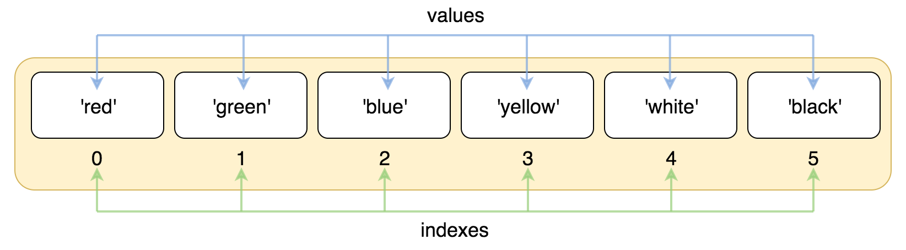
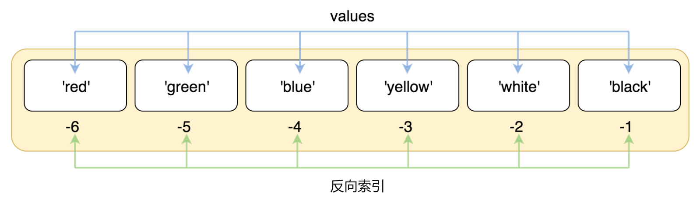
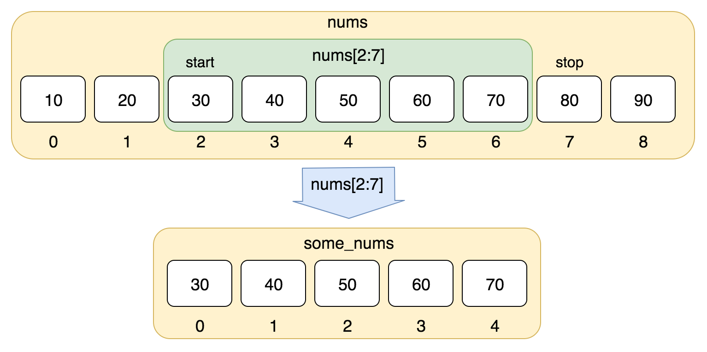

# python基本数据类型

## 数值型（Number）

### 整数型（int）

> 通常被称为是整型或整数，是正或负整数，不带小数点

> 其中1和0也可以代表 [bool](https://docs.python.org/zh-cn/3/library/functions.html?highlight=bool#bool)
> 类型中的True和False

### 浮点型(float)

> 浮点型由整数部分与小数部分组成（即数学中的小数类型），浮点型也可以使用科学计数法表示（2.5e2 = 2.5 x 102 = 250）

## 字符串(str)

详见 [string_example.py](string_example.py)

> 字符串是 Python 中最常用的数据类型。我们可以使用引号( ' 或 " )来创建字符串。

两个字符串示例

```python
var1 = 'Hello World!'
var2 = "Run"
```

### 字符串拼接

```python
# 使用加号连接
test = 'abc' + 'b'

# 使用 {}+f 拼接
str_1 = f'{test},qws'
# return value： abcb,qws

# 使用 %s 占位符
str_2 = 'a=%s b=%s' % (1, 2)

# 使用 join 函数讲list拼接成字符串
test_list = ['foo', 'bar', '1', '3']
str_3 = '|'.join(test_list)
# return value： foo|bar|1|3
```

## [列表(list)](https://www.runoob.com/python3/python3-list.html)

详细见项目 [list_example](list_example.py)

列表是 Python 中最基本的数据结构。
列表中的每个值都有对应的位置值，称之为索引，第一个索引是 0，第二个索引是 1，依此类推。

列表索引从 0 开始，第二个索引是 1，依此类推。

```python
list = ['red', 'green', 'blue', 'yellow', 'white', 'black']
print(list[0])
print(list[1])
print(list[2])
# 返回值依次是
'''
red
green
blue
'''
```



索引也可以从尾部开始，最后一个元素的索引为 -1，往前一位为 -2，以此类推。

```python
list = ['red', 'green', 'blue', 'yellow', 'white', 'black']
print(list[-1])
print(list[-2])
print(list[-3])
# 返回值一次是
# black
# white
# yellow
```



也可以使用方括号 [] 的形式截取字符，如下所示：

```python
nums = [10, 20, 30, 40, 50, 60, 70, 80, 90]
print(nums[0:4])
# 返回值 [10, 20, 30, 40]
```



## [字典（dict）](https://www.runoob.com/python3/python3-dictionary.html)

> 字典的每个键值 key=>value 对用冒号 : 分割，
> 每个对之间用逗号(,)分割，整个字典包括在花括号 {} 中 ,格式如下所示：

```python
d = {'key1': 'value1', 'key2': 'value2', 'key3': 'value3'}
```

## [元组(tuple)](https://www.runoob.com/python/python-tuples.html)

> 元组与list类似，用()表示，元组不能二次赋值，相当于只读列表

## [集合(set)](https://www.runoob.com/python3/python3-set.html)

> 集合（set）是一个无序的不重复元素列表

```python
list = [1, 2, 3, 3, 3, 4]
print(set(list))
# 返回值= {1, 2, 3, 4}
```
